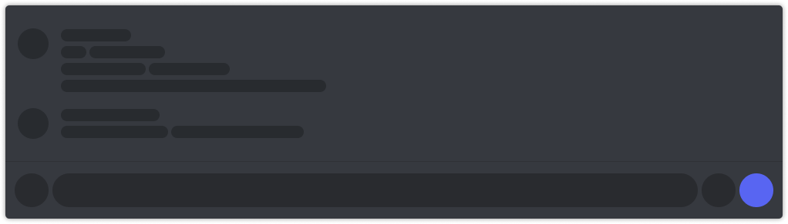

## Downloads
### **[Replugged](https://replugged.dev/)**
1. Download the [.asar file](https://github.com/discord-extensions/bubble-bar/releases/latest/download/dev.LuckFire.BubbleBar.asar).
2. Save it to your replugged themes folder.
    - **Windows** `%appdata%/replugged`
    - **macOS** `~/Library/Application Support/replugged`
    - **Other** `$XDG_CONFIG_HOME/replugged` or `~/.config/replugged`

### **[BetterDiscord](https://betterdiscord.app/)**
- [Direct Download](https://github.com/discord-extensions/bubble-bar/releases/latest/download/bubble-bar.theme.css)
- [Compiled Source](https://discord-extensions.github.io/bubble-bar/src/source.css)

### **Stylus**
1. Install the broswer extensions for your repsective browser.
    - [Chrome Webstore](https://chrome.google.com/webstore/detail/stylus/clngdbkpkpeebahjckkjfobafhncgmne)
    - [Firefox Addons](https://addons.mozilla.org/en-US/firefox/addon/styl-us/)
2. Once installed, open [this link](https://discord-extensions.github.io/bubble-bar/clients/stylus/bubble-bar.user.css) in a new browser tab. This opens the page where you will install this userstyle.
3. Press the `Install Style` button.

###### Firefox users must have "Patch CSP to allow style assets" enabled for the theme to work. This can be found in Stylus' settings under "Advanced"

## Credits
View [CREDITS.md](./CREDITS.md) for a list of contributors.

## Support
If you encounter any issues with this theme, feel free to make an issue or PR fixing it! Alternatively, if you need help, feel free to join my [support server](https://discord.gg/vYdXbEzqDs) and ask there!